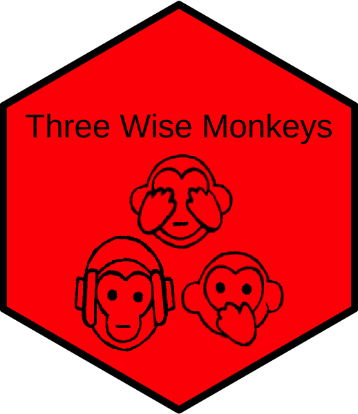

# SwimmeR 

## Introduction
`ThreeWiseMonkeys` is an implementation of the Japanese pictoral maxim "See no evil, "

## What's the point?
`ThreeWiseMonkeys` is an experiment.  It began when I noticed that ~1700 people had downloaded an early version of my `SwimmeR` pacakge.  `SwimmeR` by it's nature has only niche utility as it's use is downloading, cleaning and otherwise working with competivie 
